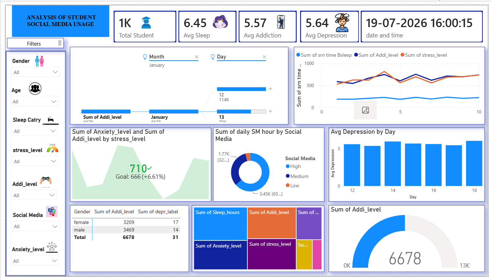

# 📊 Social Media Analytics Dashboard (Power BI)

## 📌 Overview

This project is an interactive Power BI dashboard that analyzes social media usage and its relationship with mental health indicators such as anxiety, depression, addiction level, and screen time.

## ✨ Features

- Interactive dashboard
- KPI Cards
- Slicers and Filters
- DAX Measures
- Power Query Transformations
- Data Visualization
- Drill-down Analysis

## 🛠️ Tools Used

- Power BI Desktop
- Power Query
- DAX
- Microsoft Excel

## 📂 Files Included

- socialMediaDashboard.pbix
- Dataset.xlsx
- Dashboard.png

## 📸 Dashboard Preview

## 📈 Insights

- Screen time trends
- Anxiety level analysis
- Depression analysis
- Addiction level comparison
- Interactive filtering by different attributes
